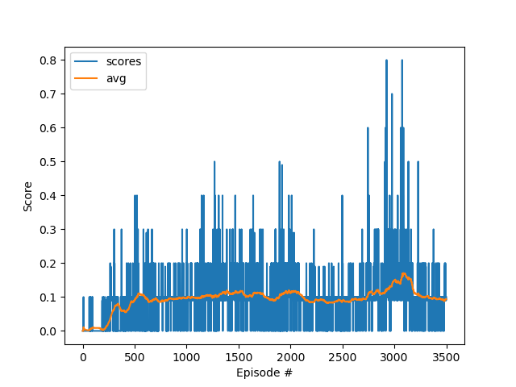
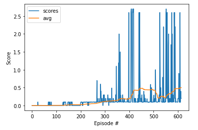

# Project report
This is the report for the Continuous Control problem.

## Learning algorithm
The learning algorithm used to solve this problem is DDPG (Deep Deterministic Policy Gradient).

### Some quick facts about DDP:
- off-policy algorithm.
- can only be used for environments with continuous action spaces.
- can be thought of as being deep Q-learning for continuous action spaces.

### NN-Model Architecture
- Actor = fully connected layer [24 256] , fully connected layer [256 256] , fully connected layer [256 4] ,with tanh activation
- Critic = fully connected layer [24 256] , fully connected layer [256 256] , fully connected layer [256 1] ,with relu activation

### Taining parameters used:
- buffer size: 10^5
- batch size: 128
- lr actor: 10^-4 (coefficient that scale delta before it is applied to the parameters - for actor) 
- lr critic: 10^-3 (coefficient that scale delta before it is applied to the parameters -for critic) 
- gamma: 0.99
- tau: 10^-2

- target score: 0.5
- target episodes: 100

## Results:
Succsesfully training this enviroment took some time using DDPG, 
### First attempt : (using a different NN dimentions of [64 64] for hidden layer

As you can see bellow the agent was having a hard time going over 0.1 rewards with this architecture which promted me to the second attempt

### Second attempt : (using a the suggested NN model [256 256] for hidden layer)
As well as using a bigger network I also changed the value of Tau value from 1e-3 to 1e-2 which seemed to also increase preformance was not yet close to the target

### 3rd and Succesful attempt:
Finnaly after tunning the Noise values in the Ornstein-Uhlenbeck process to theta = 0.15 and sigma = 0.1 , was enough to solve this enviroment.

The algorithm was able to solve the problem in 615 episodes

## Future work and Improvments
- I would like to try different architectures for both actor and critic networks
- Using MADDPG will make training connvergence easier
-  Using a technique called curiclum learing seems to show much better results in litrature
- Compare results with PPO
- Further tuning of hyperparameters
